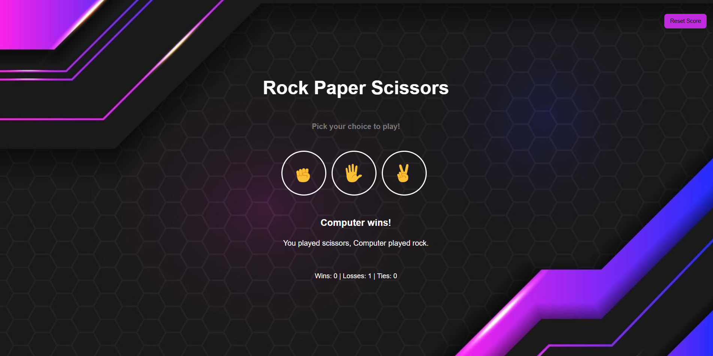

# Rock Paper Scissors Game Using LocalStorage

## LocalStorage with JavaScript
LocalStorage is a browser feature that allows you to store data persistently on the client side. This data remains even if the user refreshes the page or closes and reopens the browser. It's a great tool for saving game progress, scores, settings, or any other small data without involving a server.

## In this guide, we will show you how to enhance your Rock-Paper-Scissors Game by using LocalStorage. The core functionality includes:

- **Saving the user's score**: Track the player's win/loss record and save it to LocalStorage to persist the data across sessions.
  
- **Loading saved scores**: Automatically retrieve and display the user's score when the game loads.
  
- **Resetting scores**: Allow the user to reset their score, clearing the saved data from LocalStorage.

## Features
- **Game Result:** The game displays the outcome (Win, Lose, or Draw) after each round.
  
- **Score Persistence:** Player scores are stored in the browser's LocalStorage, so the score persists even after refreshing or closing the browser.
  
- **Reset Game:** sers can reset the game, which will clear the scores stored in LocalStorage.

## Technologies Used
- **HTML**: For structuring the game interface.
  
- **CSS**: For styling the layout and design.
  
- **JavaScript**: For the game logic, including handling the player's move, the computer's move, and determining the winner.
  
- **LocalStorage**: For saving and retrieving the player’s score across sessions.

## Live Demo
You can play the game live by visiting this URL :
[Live Demo of Rock Paper Scissors](https://rahaf-ayn-kraie.github.io/rock-paper-scissors-game/)

### 1. **HTML**:
The HTML structure provided defines a simple and interactive **Rock Paper Scissors game**. It uses semantic elements and includes essential metadata like author, description, and keywords to enhance its searchability and accessibility. The game consists of:

- **Title and Instruction**: Clear headings (`<p>`) guide users to pick their choice.
  
- **Buttons for Choices**: Rock, Paper, and Scissors options are represented visually with emoji images.
  
- **Result and Score Display**: Dynamic paragraphs (`<p>`) show game outcomes and keep track of scores.
  
-**Reset Button**: A button to reset the game scores and start fresh.

### 2. **CSS**:
This CSS styles a Rock, Paper, Scissors game with a modern look. It uses CSS variables for color, a background image, and flexbox for centering the layout. The buttons have a hover effect that scales them, providing interactive feedback, and a reset button is fixed at the top right for easy access.

The page is styled using external CSS, reset styles for consistency, and Google Fonts for a modern look. It also includes Font Awesome for icons and integrates JavaScript to handle game functionality

### 3. **JavaScript**:
- ** Function to selecte DOM Elements**: The select function simplifies selecting elements
```
function select(selector, scope = document) {
  return scope.querySelector(selector);
}

// Example: Selecting buttons and text elements
const rockButton = select('.rock-button');
const resultText = select('.result');
```
-** Function to add Event Listeners**: The listen function binds event listeners to elements
```
function listen(event, selector, callback) {
  return selector.addEventListener(event, callback);
}

// Example: Handling button clicks
listen('click', rockButton, () => playGame('rock'));
listen('click', resetButton, () => {
  score.wins = 0;
  score.losses = 0;
  score.ties = 0;
});
```
-**Storing and Retrieving Data with LocalStorage**: You use LocalStorage to persist game scores across sessions
```
localStorage.setItem('score', JSON.stringify(score));

// Retrieve saved data from LocalStorage
const savedScore = JSON.parse(localStorage.getItem('score'));
if (savedScore) {
  score.wins = savedScore.wins;
  score.losses = savedScore.losses;
  score.ties = savedScore.ties;
}
```

## Installation and Setup

### 1. Clone the Repository
To get started, clone this repository to your local machine:

```bash
git clone https://github.com/Rahaf-Ayn-Kraie/rock-paper-scissors-game.git
```

### 2. Navigate to the project folder:
```
cd rock-paper-scissors
```
### 3. Run the project:
- Open the index.html file in your web browser to play the game.
  
